# 🛒 Petit projet de test : Order_Delivery

**Auteur :** Alex

---

## 📌 Présentation

Ce projet met en place **un environnement complet** composé de **deux applications Spring Boot** communiquant entre elles via **API REST** et **JMS**.  
Il est conçu pour servir de **support de démonstration**, couvrant :

- Développement backend & frontend (Java + Spring Boot + Thymeleaf)
- Communication inter-services (REST + JMS)
- Authentification & autorisations (Spring Security)
- Persistance (H2 en mémoire)
- Tests automatisés (Robot Framework + Selenium)
- Orchestration locale (Docker Compose)
- Monitoring (Grafana)
- Application mobile

---

## 🏗 Architecture fonctionnelle

```
[User] --> [Order Manager UI/REST] --REST--> [Delivery Tracker UI/REST]
                |                                        ^
                v                                        |
           JMS queue.orders.new  via ActiveMQ Artemis ----
```

- **Order Manager**
  - UI + API REST `/orders`
  - Création / modification / consultation de commandes
  - Émission d'un message JMS `OrderCreated` → `queue.orders.new`
  
- **Delivery Tracker**
  - Consommation JMS `queue.orders.new`
  - UI + API REST `/deliveries`
  - Suivi de livraison + mise à jour de statut
  - Notification REST vers Order Manager

---

## 🛠 Stack technique

- **Java 21**
- **Spring Boot 3.x**
- **Thymeleaf** (UI)
- **Spring Security**
- **ActiveMQ Artemis** (broker JMS)
- **H2 Database**
- **Maven**
- **Docker Compose**
- **Robot Framework + Selenium** (tests automatisés UI & API)
- **Prometheus + Loki + Grafana**
- **Postgres + Adminer**

### à venir : 

- **Selenium + RobotFramework**
- **AWS**
- **JMeter**
- **Appium**

Et d'autres

---

## 📂 Structure du projet

```
my-demo-project/
├── docker-compose.yml
├── order-manager/
│ ├── pom.xml
│ └── src/...
├── delivery-tracker/
│ ├── pom.xml
│ └── src/...
├── tests/
│ ├── robot/
│ │ ├── api_tests.robot
│ │ ├── ui_tests.robot
│ │ └── resources/
├── docs/
│ ├── architecture.png
│ └── functional_spec.md
└── README.md
```
---

## 🚀 Installation et démarrage

**Prérequis :**
- Docker + Docker Compose (Docker desktop optionnel mais utile)
- Java 17
- Maven

**1️⃣ Cloner le projet**

```
git clone https://github.com/TON_COMPTE/my-demo-project.git
cd my-demo-project```
```

**2️⃣ Lancer l'environnement**

> docker-compose up --build

### **Lancer les applications unitairement**

#### Lancer ActiveMQ Artemis en local :

```
docker run -it --rm \
    -e ARTEMIS_USER=admin \
    -e ARTEMIS_PASSWORD=admin \
    -p 8161:8161 -p 61616:61616 \
    quay.io/artemiscloud/activemq-artemis-broker:latest
```

#### Lancer order-manager :

```
cd order-manager
mvn spring-boot:run
```


#### Lancer delivery-tracker :

```
cd delivery-tracker
mvn spring-boot:run
```


#### Déployer tous les conteneurs :

Si besoin de redéployer après nouvelle modification : 

> docker compose down -v

Build des conteneurs depuis le fichier docker-compose :

> docker compose build --no-cache

Déploiement des conteneurs : 

> docker compose up


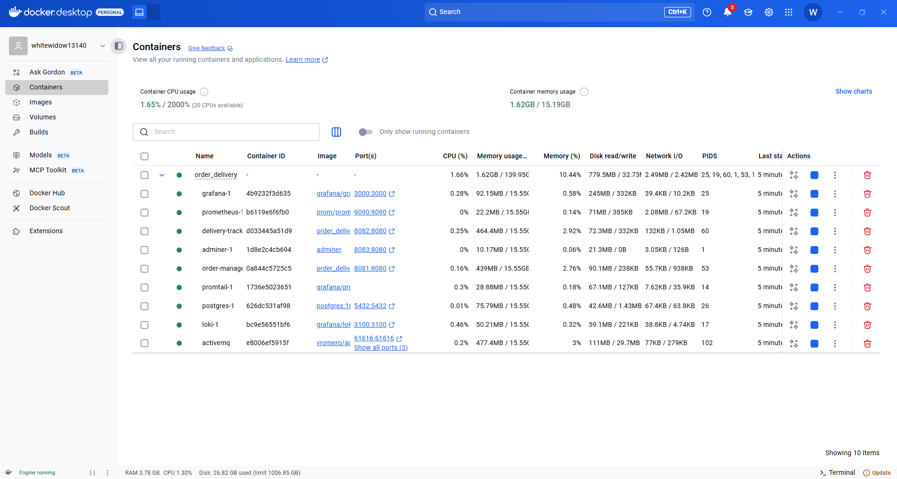


3️⃣ Accéder aux applications

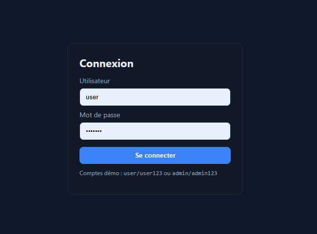

* Order Manager : http://localhost:8081


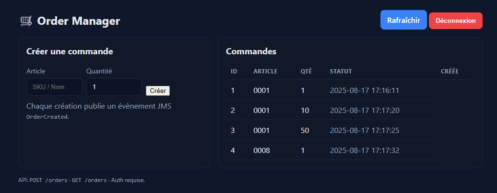

* Delivery Tracker : http://localhost:8082


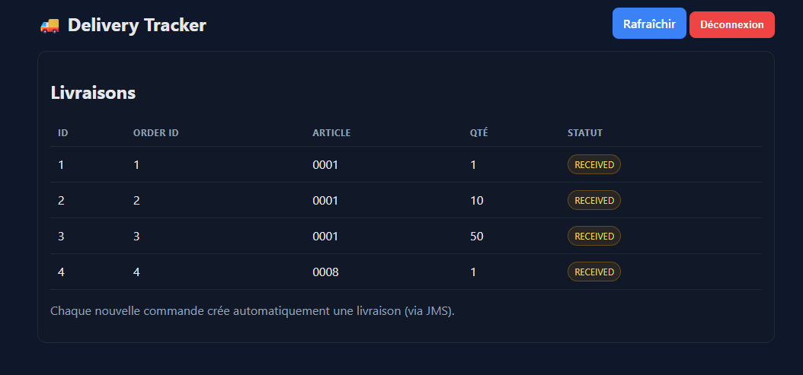

* ActiveMQ Console : http://localhost:8161 (admin/admin)

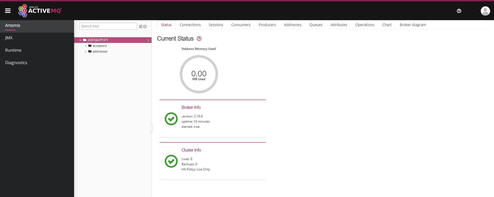


4️⃣ Comptes par défaut

| Login | Mot de passe | Rôle  |
| ----- | ------------ | ----- |
| admin | admin123     | ADMIN |
| user  | user123      | USER  |


### H2 console

#### Order Manager : http://localhost:8081/h2-console

JDBC URL : jdbc:h2:mem:orders

User : sa — Password : (vide)

#### Delivery Tracker : http://localhost:8082/h2-console

JDBC URL : jdbc:h2:mem:delivery

User : sa — Password : (vide)


### AdMiner

Adminer UI : http://localhost:8083 

→ System “PostgreSQL”
→ Server postgres 
→ User demo
→ Pass demo
→ DB demo


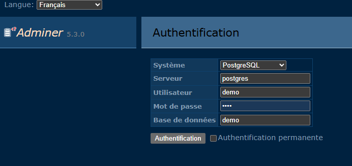

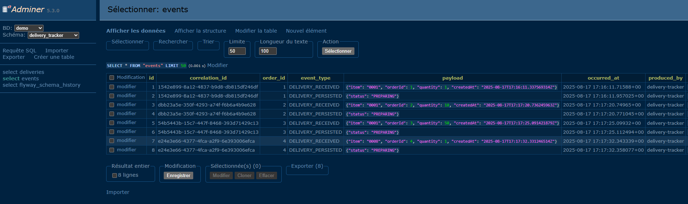

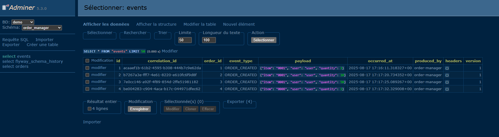

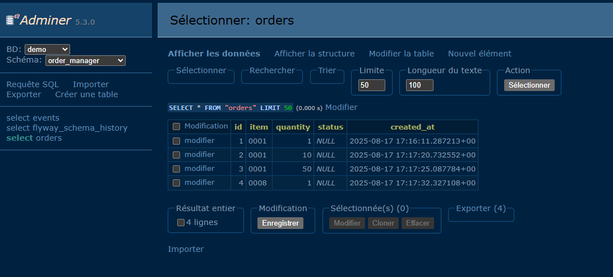

### Prometheus / Loki

http://localhost:9090/targets

http://localhost:8081/actuator/prometheus → om_orders_created_total.

http://localhost:8082/actuator/prometheus → dt_delivery_e2e_ms_bucket & dt_jms_consume_seconds_count

datasources:
  - name: Prometheus
    type: prometheus
    uid: prom
    access: proxy
    url: http://prometheus:9090
    isDefault: true

  - name: Loki
    type: loki
    uid: loki
    access: proxy
    url: http://loki:3100

Loki :

http://localhost:3000/explore?schemaVersion=1&panes=%7B%22g7s%22:%7B%22datasource%22:%22eevamue0nf5dsf%22,%22queries%22:%5B%7B%22refId%22:%22A%22,%22expr%22:%22%7Bservice%3D%5C%22delivery-tracker%5C%22%7D%20%7C%3D%20%60%60%22,%22queryType%22:%22range%22,%22datasource%22:%7B%22type%22:%22loki%22,%22uid%22:%22eevamue0nf5dsf%22%7D,%22editorMode%22:%22builder%22,%22direction%22:%22backward%22%7D%5D,%22range%22:%7B%22from%22:%22now-1h%22,%22to%22:%22now%22%7D,%22compact%22:false%7D%7D&orgId=1


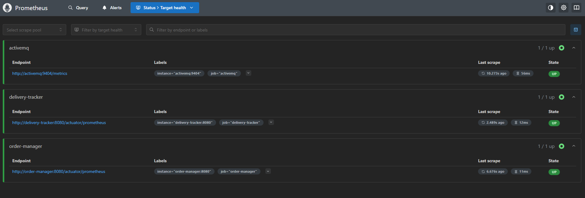

### Grafana

http://localhost:9090/targets → 3 cibles UP.

http://localhost:3000 (admin/admin) → (importer un dashboard JVM?)

http://localhost:3000/drilldown

http://localhost:3000/explore?schemaVersion=1&panes=%7B%2284x%22:%7B%22datasource%22:%22grafana%22,%22queries%22:%5B%7B%22queryType%22:%22randomWalk%22,%22refId%22:%22A%22,%22datasource%22:%7B%22type%22:%22datasource%22,%22uid%22:%22grafana%22%7D%7D%5D,%22range%22:%7B%22from%22:%22now-1h%22,%22to%22:%22now%22%7D,%22compact%22:false%7D%7D&orgId=1


A. COMMANDES CRÉÉES (Order Manager) Filtre ORDER_CREATED, extrait corrId et l’affiche :
http://localhost:3000/explore?schemaVersion=1&panes=%7B%22A%22%3A%7B%22datasource%22%3A%7B%22type%22%3A%22loki%22%2C%22uid%22%3A%22loki%22%7D%2C%22queries%22%3A%5B%7B%22refId%22%3A%22A%22%2C%22expr%22%3A%22%7Bservice%3D%5C%22order-manager%5C%22%7D+%7C%3D+%5C%22ORDER_CREATED%5C%22+%7C+regexp+%5C%22%28%3Fi%29%28corrId%7CcorrelationId%29%3D%28%3FP%3CcorrId%3E%5B0-9a-fA-F-%5D%7B36%7D%29%5C%22+%7C+line_format+%5C%22%7B%7B.corrId%7D%7D+%7B%7B.message%7D%7D%5C%22%22%7D%5D%2C%22range%22%3A%7B%22from%22%3A%22now-1h%22%2C%22to%22%3A%22now%22%7D%7D%7D&orgId=1

B. ÉVÉNEMENTS REÇUS (Delivery Tracker) Filtre DELIVERY_RECEIVED, extrait corrId :
http://localhost:3000/explore?schemaVersion=1&panes=%7B%22A%22%3A%7B%22datasource%22%3A%7B%22type%22%3A%22loki%22%2C%22uid%22%3A%22loki%22%7D%2C%22queries%22%3A%5B%7B%22refId%22%3A%22A%22%2C%22expr%22%3A%22%7Bservice%3D%5C%22delivery-tracker%5C%22%7D+%7C%3D+%5C%22DELIVERY_RECEIVED%5C%22+%7C+regexp+%5C%22%28%3Fi%29%28corrId%7CcorrelationId%29%3D%28%3FP%3CcorrId%3E%5B0-9a-fA-F-%5D%7B36%7D%29%5C%22+%7C+line_format+%5C%22%7B%7B.corrId%7D%7D+%7B%7B.message%7D%7D%5C%22%22%7D%5D%2C%22range%22%3A%7B%22from%22%3A%22now-1h%22%2C%22to%22%3A%22now%22%7D%7D%7D&orgId=1

C. Suivre une COMMANDE par corrId (OM + DT dans la même vue) ➡️ remplacer REPLACE_WITH_CORR_ID par ton corrId (copié depuis la réponse HTTP ou un log) :
http://localhost:3000/explore?schemaVersion=1&panes=%7B%22A%22%3A%7B%22datasource%22%3A%7B%22type%22%3A%22loki%22%2C%22uid%22%3A%22loki%22%7D%2C%22queries%22%3A%5B%7B%22refId%22%3A%22A%22%2C%22expr%22%3A%22%7Bservice%3D%5C%22order-manager%5C%22%7D+%7C%3D+%5C%22REPLACE_WITH_CORR_ID%5C%22%22%7D%2C%7B%22refId%22%3A%22B%22%2C%22expr%22%3A%22%7Bservice%3D%5C%22delivery-tracker%5C%22%7D+%7C%3D+%5C%22REPLACE_WITH_CORR_ID%5C%22%22%7D%5D%2C%22range%22%3A%7B%22from%22%3A%22now-6h%22%2C%22to%22%3A%22now%22%7D%7D%7D&orgId=1


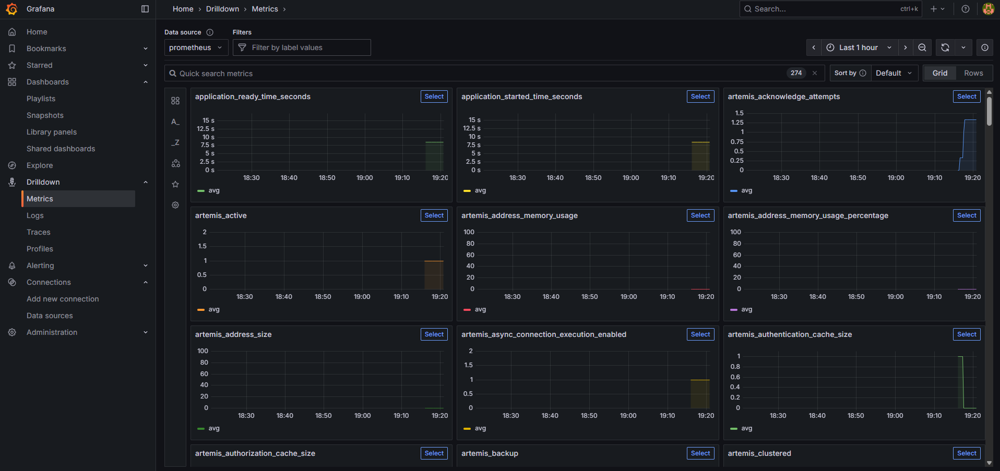


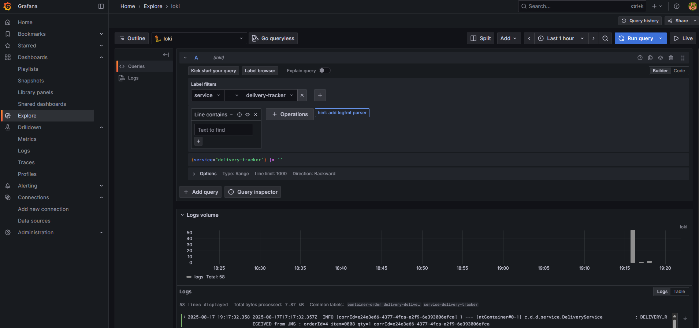


Créer une commande :

* om.orders.created doit augmenter,

* dt.delivery.e2e_ms doit enregistrer des points,

la méthode listener doit exposer dt_jms_consume_seconds_* (via @Timed).


## Github Actions - CI/CD

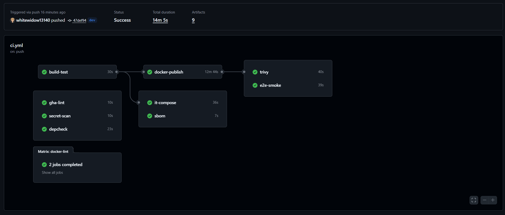

# 🧪 Lancer les tests automatisés (WIP)

1️⃣ Installer les dépendances

> pip install -r tests/requirements.txt


2️⃣ Lancer les tests API & UI

> robot tests/robot


📈 Roadmap

* V1 ✅ - Base fonctionnelle (UI + API + JMS + H2)

* V2 ✅ - Passage à PostgreSQL

* V3 ✅ - Monitoring (Prometheus + Grafana) + Loki

* V4 ⌛ - Pipeline CI/CD GitHub Actions

* V5 ⌛ - Application Web : portail d'achat pour les clients (table items, orders JSon)

* V6 ⌛ - Application mobile : portail d'achat

* V7 ⌛ - ESB + Gateway

* V8 ⌛ - Rancher + Rancher UI

* V9 ⌛ - Déploiement en ligne - AWS on demand

* V10 ⌛ - Logiques métiers 

* V11 ⌛ - Tests d’accessibilité (axe-core), Tests IHM (Selenium), Tests de charge (JMeter), Tests API (Postman), Tests mobile (Appium)